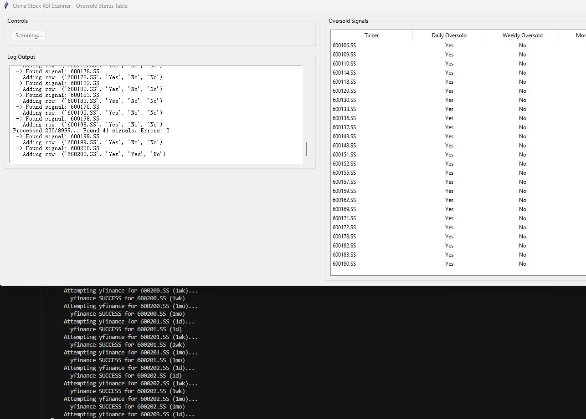

# RSI Oversold Stock Scanner / RSI超卖股票扫描器



## Description (English)

This project provides tools to scan stock markets for instruments where the Relative Strength Index (RSI) indicates an oversold condition (typically RSI <= 30) across multiple timeframes (Daily, Weekly, Monthly). It includes:

1.  A command-line script (`python/main.py`) for scanning a predefined list of global tickers (e.g., US indices, tech stocks, crypto).
2.  A command-line script (`python/main_china.py`) specifically for scanning Chinese A-shares (Shanghai & Shenzhen exchanges) using `yfinance` and `akshare` as data sources.
3.  A graphical user interface (`python/gui_china.py`) built with Tkinter for the Chinese market scanner, displaying results in a table format as they are found.

The primary focus for the Chinese market tools is identifying stocks oversold on at least the Daily chart, providing a signal for potential long opportunities.

## 描述 (中文)

本项目提供了一系列工具，用于扫描股票市场中相对强弱指数（RSI）在多个时间周期（日线、周线、月线）上显示超卖状态（通常 RSI <= 30）的标的。项目包含：

1.  一个命令行脚本 (`python/main.py`)，用于扫描预定义的全球股票列表（例如美国指数、科技股、加密货币）。
2.  一个命令行脚本 (`python/main_china.py`)，专门用于扫描中国A股（上海和深圳交易所），使用 `yfinance` 和 `akshare` 作为数据源。
3.  一个使用 Tkinter 构建的图形用户界面 (`python/gui_china.py`)，用于中国市场扫描器，在扫描过程中实时将结果显示在表格中。

针对中国市场的工具主要侧重于识别至少在日线图上处于超卖状态的股票，为潜在的做多机会提供信号。

## Features / 功能

*   **Multi-Timeframe RSI Check:** Analyzes Daily, Weekly, and Monthly charts. / **多时间周期RSI检查：** 分析日线、周线和月线图表。
*   **Configurable RSI Period & Threshold:** Easily change RSI settings (default: 14 period, 30 threshold). / **可配置RSI周期与阈值：** 可轻松更改RSI设置（默认：14周期，30阈值）。
*   **Dual Data Sources (China):** Uses `yfinance` with `akshare` fallback for Chinese stocks, increasing data reliability. / **双数据源(中国市场)：** 对中国股票使用 `yfinance` 并以 `akshare` 作为备用，提高数据可靠性。
*   **CLI & GUI Options:** Provides both command-line scripts and a graphical interface (for China scan). / **命令行与图形界面选项：** 提供命令行脚本和图形界面（用于中国市场扫描）。
*   **Real-time GUI Updates (China):** The GUI table updates immediately when a signal is found. / **实时GUI更新(中国市场)：** 图形界面表格在发现信号时立即更新。

## Requirements / 依赖环境

*   Python 3.x
*   Required libraries listed in `python/requirements.txt`. Install using pip: / Python 3.x 及 `python/requirements.txt` 文件中列出的库。使用 pip 安装：
    ```bash
    pip install -r python/requirements.txt
    ```

## Usage / 使用方法

### 1. Global Scanner (Command Line) / 全球市场扫描器 (命令行)

*   Modify the `TICKERS` list in `python/main.py` if desired. / (可选) 修改 `python/main.py` 文件中的 `TICKERS` 列表。
*   Run the script: / 运行脚本：
    ```bash
    python python/main.py
    ```
*   Results (stocks oversold on D/W/M) will be printed to the console. / 结果（在日/周/月线上均超卖的股票）将打印到控制台。

### 2. China Scanner (Command Line) / 中国市场扫描器 (命令行)

*   The script automatically generates potential A-share ticker symbols based on exchange rules. / 脚本根据交易所规则自动生成潜在的A股代码。
*   Run the script: / 运行脚本：
    ```bash
    python python/main_china.py
    ```
*   Logs RSI status for each timeframe and prints stocks found oversold on D/W/M. / 打印各时间周期的RSI状态，并输出在日/周/月线上均超卖的股票。
*   Generates `.png` plot files for stocks found oversold on all three timeframes. / 为在所有三个时间周期上都超卖的股票生成 `.png` 图表文件。

### 3. China Scanner (GUI) / 中国市场扫描器 (图形界面)

*   Ensure `main_china.py` is present in the `python` directory for importing functions. / 确保 `main_china.py` 在 `python` 目录下以便导入函数。
*   Run the GUI script: / 运行图形界面脚本：
    ```bash
    python python/gui_china.py
    ```
*   Click "Start Scan". / 点击 "Start Scan"。
*   The log area shows scan progress and details. / 日志区域显示扫描进度和详情。
*   The table updates in real-time, showing tickers with at least a Daily oversold signal and their status ("Yes"/"No") on Weekly and Monthly charts. / 表格实时更新，显示至少日线超卖的股票及其在周线和月线上的状态（"Yes"/"No"）。

## Disclaimer / 免责声明

*   **English:** Stock market data is obtained from free APIs (`yfinance`, `akshare`). Data may be delayed, incomplete, or inaccurate. This tool is for educational and informational purposes only and does not constitute financial advice. Use at your own risk.
*   **中文:** 股票市场数据通过免费API（`yfinance`, `akshare`）获取。数据可能存在延迟、不完整或不准确的情况。本工具仅用于教育和信息目的，不构成任何投资建议。使用风险自负。 